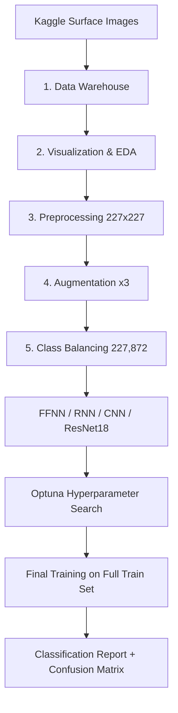

# 🧱 Surface Crack Classification - Multi-Architecture Neural Network Comparison

[]()
[]()
[]()
[]()
[](LICENSE)

**Surface Crack Classification** is a deep learning project that compares four neural network architectures - FFNN, LSTM-RNN, CNN, and Transfer Learning (ResNet18) - for binary classification of cracked vs. non-cracked concrete surface images. It delivers an end-to-end data pipeline (warehousing, EDA, preprocessing, augmentation, class balancing), an Optuna-driven hyperparameter search, and reproducible model evaluation, reaching a top accuracy of **86%** with ResNet18 transfer learning.

---

## ✨ Key Features

### 🎯 1. Multi-Architecture Model Comparison
- Four architectures trained on the same balanced dataset: **FFNN**, **LSTM-RNN**, **CNN**, and **Transfer Learning (ResNet18)**.
- Base and hyperparameter-tuned runs per model, with best hyperparameters saved to `best_hparams.json`.

### ⚡ 2. End-to-End Data Pipeline
- Five sequential notebooks build the training set: raw data inventory → EDA → uniform resize to 227×227 → ×3 augmentation (Flip + ColorJitter) → majority undersampling to **227,872 balanced images**.

### 🔍 3. Optuna Hyperparameter Search
- Shared `run_search` wrapper runs 30 trials per model on a 25% data subset.
- Search spaces include `optimizer`, `scheduler`, `num_layers`, `lr0`, and `dropout` with optimizer/scheduler dispatch helpers.

### 📊 4. Shared Training & Evaluation Utilities
- `utils/training.py` provides a common `train_model` / `evaluate_model` loop with early stopping, scheduler dispatch, and best-checkpoint saving.
- Evaluation reports include classification reports and confusion matrices for every run.

### 📈 5. Deep Performance Insights
- Documented misclassification analysis: the Cracked class is consistently harder to detect (microcracks visually resemble normal texture).
- Transfer Learning raises Cracked recall from 52-68% (from-scratch) to **81%** using pretrained ImageNet features.

---

## 🏗️ System Architecture



---

## 🛠️ Technology Stack

### Backend / Core
- **Language**: Python ≥ 3.13
- **Deep Learning**: PyTorch + torchvision (installed separately for CUDA wheel compatibility)
- **Hyperparameter Tuning**: Optuna ≥ 4.8.0
- **Machine Learning**: scikit-learn ≥ 1.8.0 (classification report, confusion matrix)

### Data & Processing
- **Data Manipulation**: pandas ≥ 3.0.2, numpy ≥ 2.4.4
- **Image Processing**: Pillow, opencv-python ≥ 4.13.0
- **Visualization**: matplotlib ≥ 3.10.8, seaborn ≥ 0.13.2
- **Progress**: tqdm ≥ 4.67.3

### Tooling
- **Dependency Management**: [uv](https://github.com/astral-sh/uv) (`uv sync` + `uv.lock`)
- **Notebooks**: ipykernel, Jupyter

---

## 🚀 Getting Started

### Prerequisites
- **Python ≥ 3.13**
- **uv**: Fast Python package manager
- **CUDA-compatible GPU** (recommended) or CPU-only

### 1. Repository Setup
```bash
git clone https://github.com/MarwanAbdellah/surface-crack-classification.git
cd surface-crack-classification
```

### 2. Install Dependencies
```bash
# Install uv (if not already installed)
pip install uv

# Create virtual environment and install project dependencies
uv sync
```

PyTorch is **not** listed in `pyproject.toml` - it must be installed separately with the wheel matching your CUDA version:

```bash
# Example: CUDA 12.1
uv pip install torch torchvision torchaudio --index-url https://download.pytorch.org/whl/cu121

# Example: CUDA 11.8
uv pip install torch torchvision torchaudio --index-url https://download.pytorch.org/whl/cu118

# CPU-only
uv pip install torch torchvision torchaudio
```

### 3. Prepare the Data
Download the dataset from [Kaggle - Cracked and Non-Cracked Surface Datasets](https://www.kaggle.com/datasets/geadalfa/cracked-non-cracked-surface-datasets/data) and place it at `data/Bangunan Retak/`. Then run the notebooks **in order**:

```
1.Data_Warehouse.ipynb        →  data/images_path.csv
2.Data_Visualization.ipynb    →  (exploration only)
3.Images_Preprocessing.ipynb  →  data/df_resized.csv
4.Image_augmentation.ipynb    →  data/df_augmented.csv
5.Images_Imbalance.ipynb      →  data/trainable_df.csv  ← used by all models
```

### 4. Run the Models
Open each model notebook inside `Models/` and run all cells. Each notebook:
1. Loads `data/trainable_df.csv`
2. Builds train (augmented) and eval (plain) datasets with an 80/10/10 split (seed 42)
3. Runs an **Optuna hyperparameter search** (30 trials, 25% data subset per trial)
4. Trains the final model with best parameters on the full train set
5. Evaluates on the test set - classification report + confusion matrix

Saved checkpoints are written to `Models/saved_models/`.

---

## 🧪 Testing & Verification

No automated test suite is included; results are verified per-run through the notebooks:

- **Classification reports** with precision, recall, and F1 per class (Cracked / Non-Cracked).
- **Confusion matrices** for both base and tuned runs.
- **Baseline vs. tuned comparison** - transfer learning improves from 84% to 86% accuracy after hyperparameter tuning.

---

## 📁 Project Structure

```text
surface-crack-classification/
├── Notebooks/                  # End-to-end data pipeline (stages 1-5)
│   ├── 1.Data_Warehouse.ipynb  # Raw data inventory → images_path.csv
│   ├── 2.Data_Visualization.ipynb
│   ├── 3.Images_Preprocessing.ipynb
│   ├── 4.Image_augmentation.ipynb
│   └── 5.Images_Imbalance.ipynb
├── Models/                     # One folder per architecture
│   ├── FFNN/
│   │   ├── FFNN.ipynb          # Feed-Forward NN
│   │   └── best_hparams.json
│   ├── RNN/
│   │   ├── RNN.ipynb           # LSTM-based RNN
│   │   └── best_hparams.json
│   ├── CNN/
│   │   ├── CNN.ipynb           # Convolutional NN
│   │   └── best_hparams.json
│   └── transfer_learning/
│       ├── TransferLearning.ipynb  # Fine-tuned ResNet18
│       └── best_hparams.json
├── utils/                      # Shared utility modules
│   ├── dataset.py              # CrackDataset (eager-loading)
│   ├── training.py             # train_model / evaluate_model
│   ├── hparam_search.py        # Optuna study wrapper
│   ├── config.py               # Default configs + search spaces
│   ├── visualization.py        # Plotting helpers
│   ├── augmentation_script.py
│   └── resize_script.py
├── pyproject.toml
├── uv.lock
├── .python-version
└── .gitignore
```

---

## 👤 Author

**Marwan Abdellah**
- **GitHub**: [@MarwanAbdellah](https://github.com/MarwanAbdellah)
- **LinkedIn**: [Marwan Abdellah](https://www.linkedin.com/in/marwan-abdellah/)

---

## 📄 License

Distributed under the MIT License. See `LICENSE` for more information.
